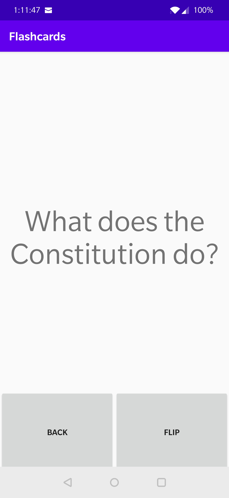

# Flashcards-Android-App

I remade https://github.com/Decretum/Flashcards into a simple android app specifically for the USCIS Citizenship test. 

There are questions on the test that have multiple correct answers, and for these, I chose the one that was easiest.

There are questions on the test that are state-specific, and I live in California, so the answers to those questions are for California. They are accurate as of July 18, 2020.

If you want to repurpose this project for your own use, simply change the list of strings in strings.xml

